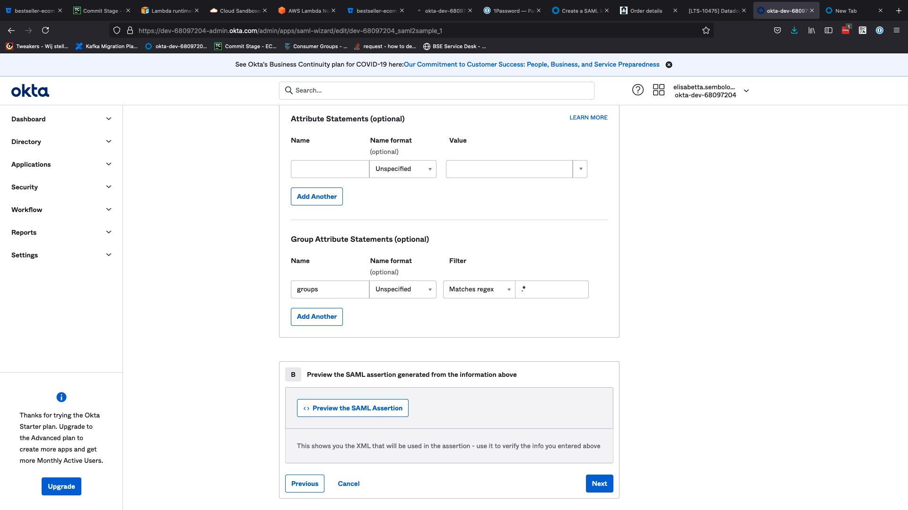
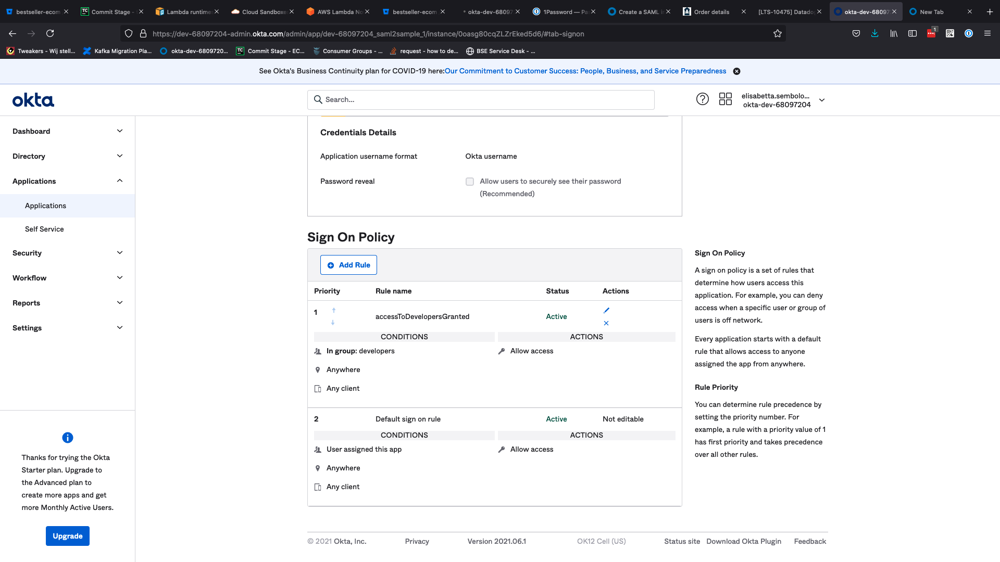

# okta-saml2-integration

this is an example on how to configure an application to work with springboot/spring-security and Okta integration 

the image below shows how the application needs to be configured in Okta to be consistent with application.properties
and the WebConfig (the POST uri is statically built)

As a use-case a post processor is configured that checks that the user is assigned to a group that has access to the application.
On the side of Okta you need to assign the application to the group with access

and you need to make sure the list of groups is returned in the saml statement.

