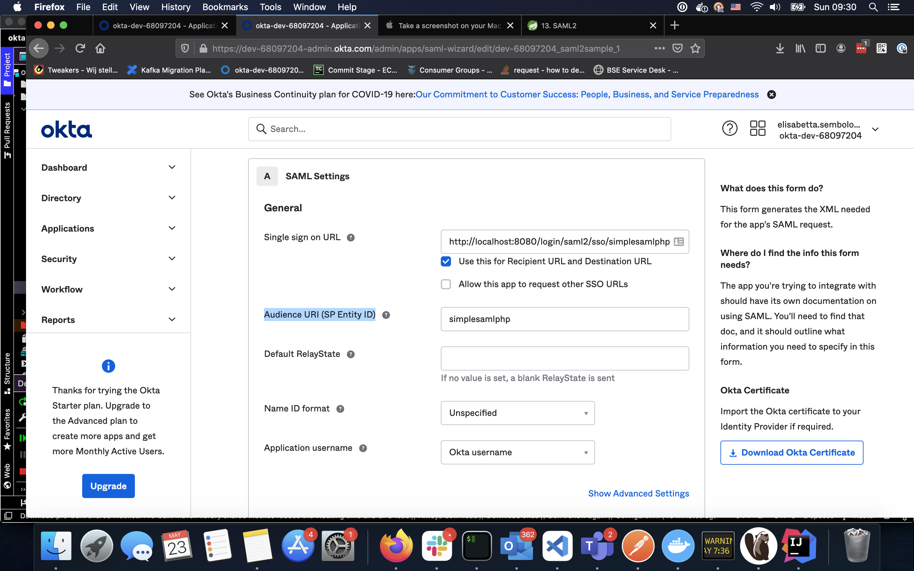

# okta-saml2-integration

this is an example on how to configure an application to work with springboot/spring-security and Okta integration 

the image below shows how the application needs to be configured in Okta to be consistent with application.properties
and the WebConfig

